# Paperprototype — Hotel Hasi

**Team:** Team Hasi
**Milestone:** MS1
**Datum:** _TT.MM.2026_
**Stil:** Lo-Fi Wireframes, **Mobile-First** (alle Screenshots zeigen die Mobile-Ansicht, da das Projekt mobile-first umgesetzt wird)
**Tools:** claude.ai (Artifacts / `claude.ai/design`)

> Dieses Dokument bündelt die Wireframes für alle User Stories U1–U5 als Bildmappe.
> Pro User Story wurde der Mobile-View in mehreren Teilen abgegriffen, weil der komplette Screen die Bildhöhe überschreitet.
> Quell-Prompts und Design-System liegen in [`prototypes/`](./prototypes/).
> Navigation-Flow und Atomic-Design-Hierarchie als Appendix unten.

---

## Inhalt

- [U1 — Hotel präsentieren (Landing / About / Imprint)](#u1--hotel-präsentieren)
- [U2 — Zimmer-Übersicht](#u2--zimmer-übersicht)
- [U3 — Verfügbarkeitsabfrage](#u3--verfügbarkeitsabfrage)
- [U4 — Buchungsflow](#u4--buchungsflow)
- [U5 — Erweiterte Bestätigung](#u5--erweiterte-bestätigung)
- [Appendix A — Navigation Flow](#appendix-a--navigation-flow)
- [Appendix B — Atomic-Design-Hierarchie](#appendix-b--atomic-design-hierarchie)

---

## U1 — Hotel präsentieren

**User Story:** Als Besucher möchte ich das Hotel auf einer Landing-Page kennenlernen sowie Imprint und About erreichen.
**Requirements:** REQ-001 … REQ-010

**Mobile-Ansicht (1/4)**

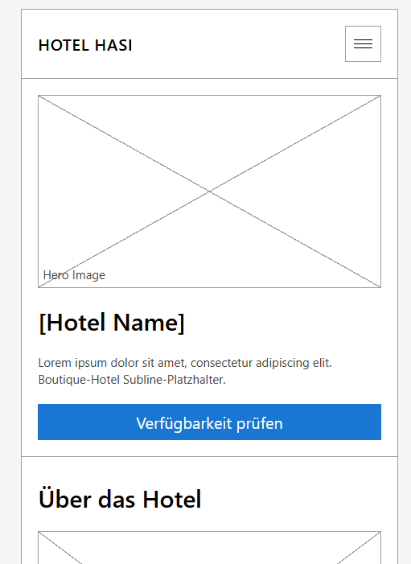

**Mobile-Ansicht (2/4)**

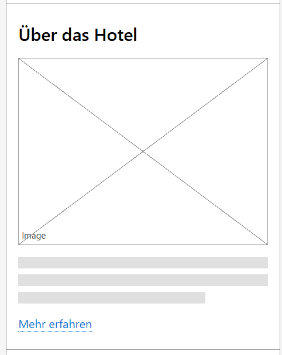

**Mobile-Ansicht (3/4)**

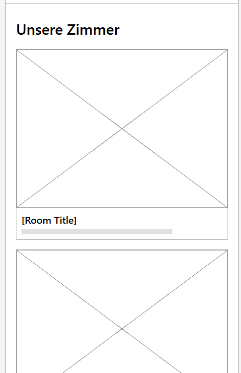

**Mobile-Ansicht (4/4)**

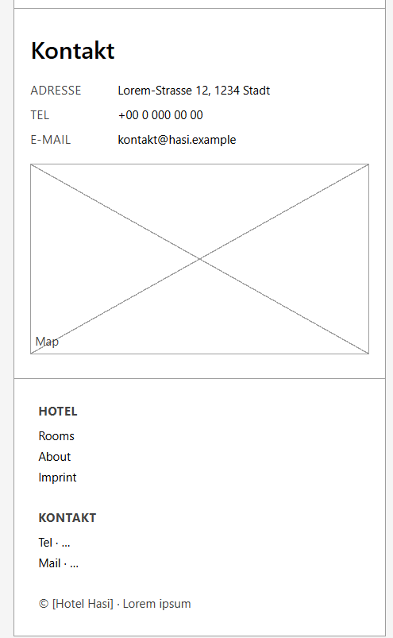

---

## U2 — Zimmer-Übersicht

**User Story:** Als Besucher möchte ich eine Übersicht aller Zimmer mit Bild, Beschreibung und Extras sehen, paginiert ab Seite 2.
**Requirements:** REQ-011 … REQ-023

**Mobile-Ansicht (1/3)**

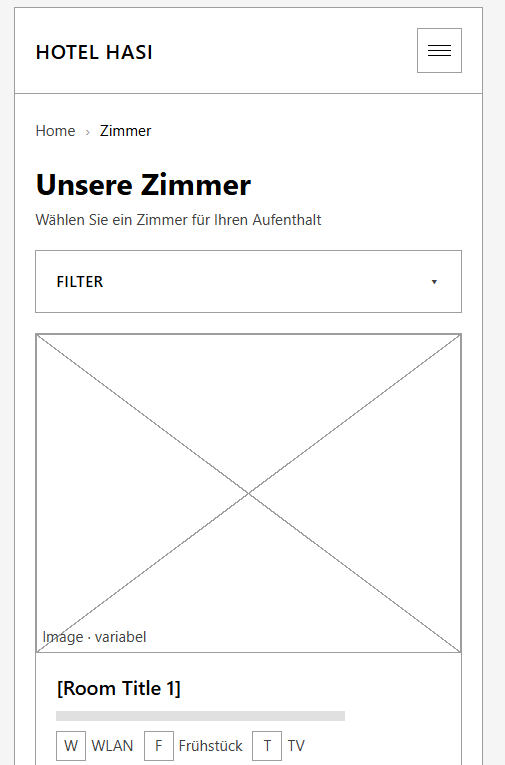

**Mobile-Ansicht (2/3)**

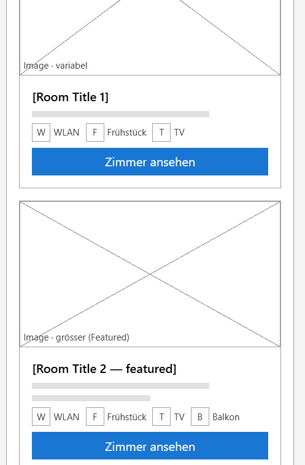

**Mobile-Ansicht (3/3)**

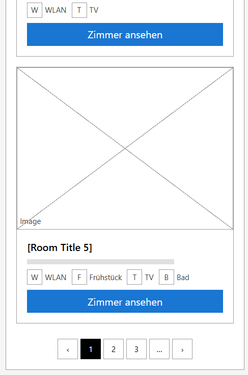

---

## U3 — Verfügbarkeitsabfrage

**User Story:** Als Besucher möchte ich für ein Zimmer einen Zeitraum wählen und sofort sehen, ob es verfügbar ist.
**Requirements:** REQ-024 … REQ-032

**Mobile-Ansicht**

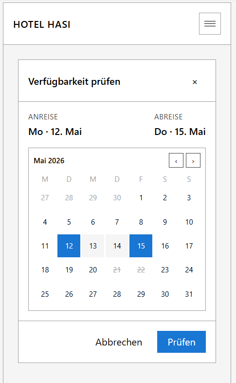

---

## U4 — Buchungsflow

**User Story:** Als Besucher möchte ich ein Zimmer mit meinen Daten buchen, vorher überprüfen und eine Bestätigung sehen.
**Requirements:** REQ-033 … REQ-049

**Mobile-Ansicht (1/2)**

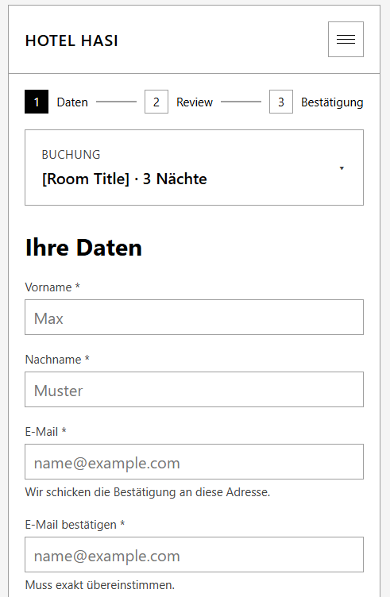

**Mobile-Ansicht (2/2)**

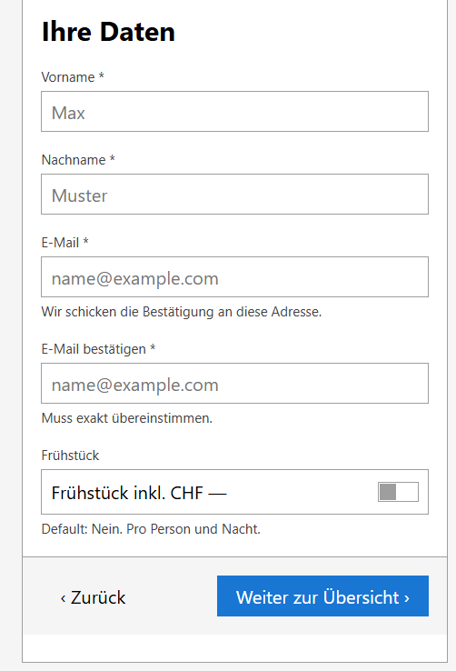

---

## U5 — Erweiterte Bestätigung

**User Story:** Als Gast möchte ich eine ausführliche Bestätigung mit Zimmerdetails, Anfahrt und Kontaktinformationen sehen, ggf. drucken.
**Requirements:** REQ-050 … REQ-059

**Mobile-Ansicht (1/3)**

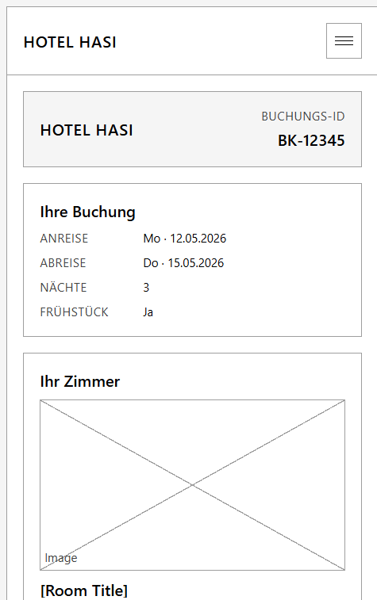

**Mobile-Ansicht (2/3)**

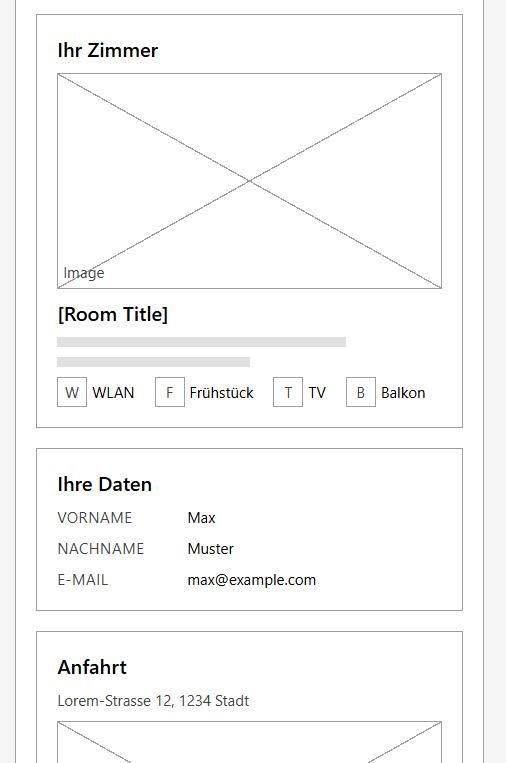

**Mobile-Ansicht (3/3)**

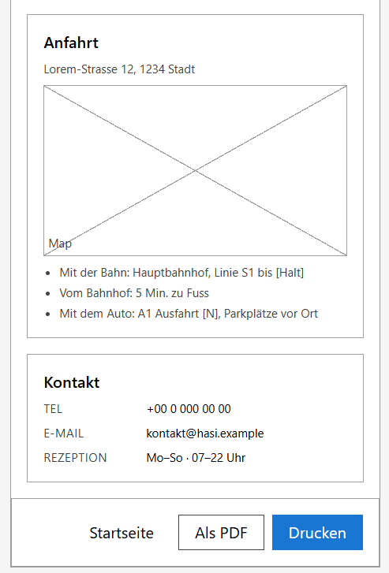

---

## Appendix A — Navigation Flow

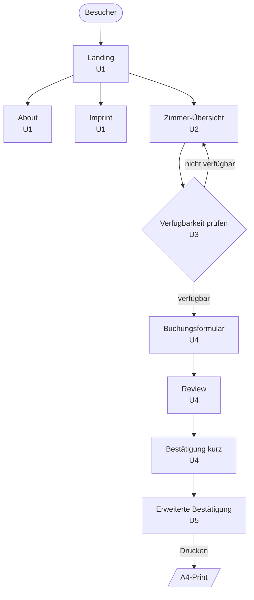

Detaillierte Variante mit Empty-/Error-States und Routenliste: [`prototypes/03-navigation-flow.md`](./prototypes/03-navigation-flow.md).

---

## Appendix B — Atomic-Design-Hierarchie

Komponenten-Karte (Auszug — vollständige Liste in [`prototypes/04-atomic-design-hierarchy.md`](./prototypes/04-atomic-design-hierarchy.md)):

- **Atoms:** Button (Primary/Secondary/Ghost/Icon), Input (Text/Email/Date), Toggle, Checkbox, Radio, Slider, Label, Helper-/Error-Text, Badge, Icon-Placeholder, Image-Placeholder, Link, Divider, Loader.
- **Molecules:** Form-Field, Card, Room-Card (horizontal/vertikal), Pagination, Breadcrumb, Date-Range-Picker (drei Varianten), Toast/Banner, Modal, Empty-State, Loading-Skeleton, Stepper, Booking-Summary.
- **Organisms:** Site-Header, Site-Footer, Hero, Room-List, Filter-Panel, Availability-Dialog, Booking-Form, Booking-Review, Confirmation-Card, Confirmation-Detail, Print-Layout, Directions-Block.
- **Templates:** Default-Page, Form-Page, Confirmation-Page, Print-Page.
- **Pages:** Landing, About, Imprint, Rooms, Booking-Form, Booking-Review, Booking-Confirmation, Booking-Detail, Booking-Print.

---

## Quell-Artifacts & Prompts

Im Ordner [`prototypes/`](./prototypes/):
- `00-briefing.md` — Briefing für claude.ai
- `01-design-system-prompt.md` — Prompt für das Design-System
- `02-screen-prompts.md` — Prompts für U1–U5
- `screens/` — alle Screenshots als PNG
