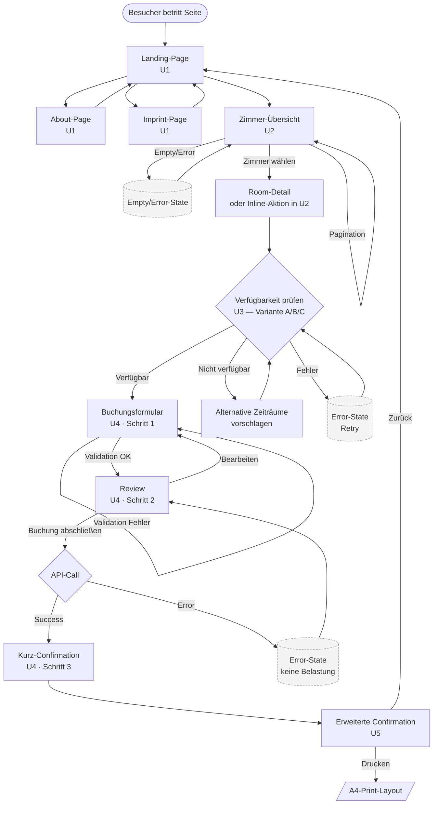

# Navigation Flow

Übersicht aller Screens und Übergänge. Erfüllt das Acceptance-Kriterium *"Navigation flow documented"*.

## Mermaid-Diagramm

## Beschreibung der Übergänge

Der Standardpfad führt vom Landing über die Zimmer-Übersicht zur Verfügbarkeitsabfrage und von dort durch das dreistufige Buchungsformular bis zur erweiterten Bestätigung. Imprint und About sind aus der Hauptnavigation jederzeit erreichbar und führen ohne Statusverlust zurück.

Pagination innerhalb der Zimmer-Übersicht ändert keinen Routing-State über den Page-Parameter hinaus; Empty- und Error-State sind keine eigenen Routen, sondern alternative Inhalte derselben Route. Bei der Verfügbarkeitsabfrage gibt es drei Designvarianten (A Klassisch, B Stepper, C Slider) — der finale Flow entscheidet sich bei MS2 für eine.

Nach erfolgreicher Buchung wird zunächst eine kurze Confirmation gezeigt (sofortiges Feedback), aus der heraus die ausführliche Confirmation (U5) zugänglich ist. Letztere besitzt einen dedizierten Print-Stylesheet-Frame, der Header/Footer/Action-Bar im Druck ausblendet.

## Routenliste (für die Vue-Implementierung in MS2)

| Pfad | View | User Story |
|---|---|---|
| `/` | Landing | U1 |
| `/about` | About | U1 |
| `/imprint` | Imprint | U1 |
| `/rooms` | RoomList | U2 |
| `/rooms?page=N` | RoomList paginiert | U2 |
| `/rooms/:id` | RoomDetail (optional) | U2/U3 |
| `/rooms/:id/availability` | Verfügbarkeitsdialog | U3 |
| `/booking` | Form (Schritt 1) | U4 |
| `/booking/review` | Review (Schritt 2) | U4 |
| `/booking/confirmation/:bookingId` | Confirmation kurz | U4 |
| `/bookings/:bookingId` | Erweiterte Confirmation | U5 |
| `/bookings/:bookingId/print` | Print-Layout | U5 |

## Render-Hinweis

Mermaid-Quelle oben in [mermaid.live](https://mermaid.live) einfügen → PNG exportieren → unter `screens/99-navigation-flow.png` ablegen.
